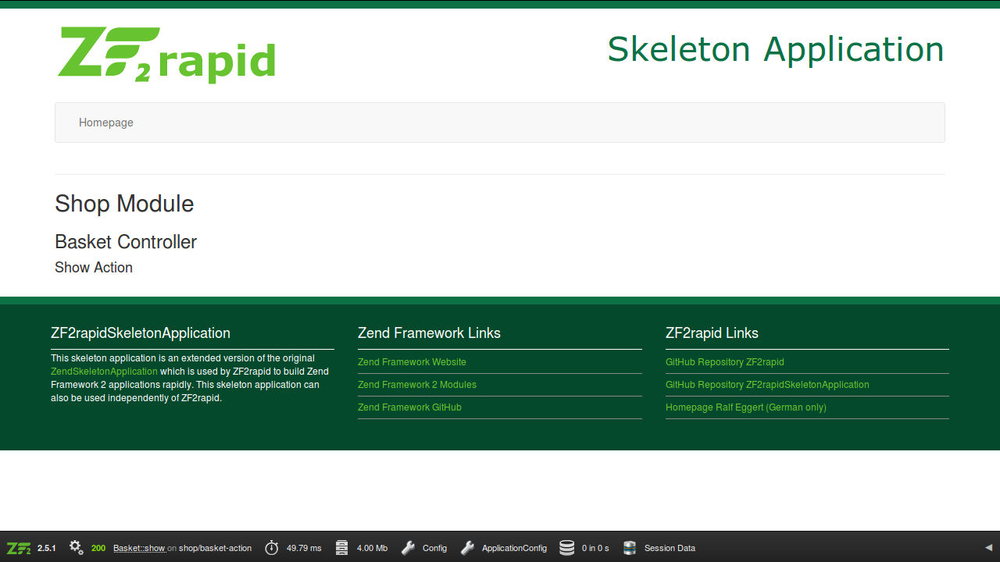

# ZF2rapid tutorial

In this tutorial you will learn how to create an application step by step with
ZF2rapid.

 * [Create new project](tutorial-create-project.md)
 * [Create new module](tutorial-create-module.md)
 * [Create controllers and actions](tutorial-create-controllers-actions.md)
 * **Create routing and generate maps**
 * [Create controller plugin and view helper](tutorial-create-controller-plugin-view-helper.md)
 * [Create model classes](tutorial-crud-create-model.md)
 * [Create application](tutorial-crud-create-application.md)

## Create routing

When you want to create the routing for a module you need to specify the 
name of the module and, optionally, the project path. 
 
    $ zf2rapid create-routing Shop

The following tasks are executed when creating the routing:

 * Check if module exists
 * Read all controllers and views for the module
 * Creating the routing configuration for the module

The routing configuration should look like this.

    <?php
    /**
     * ZF2rapid Tutorial
     *
     * @copyright (c) 2015 John Doe
     * @license All rights reserved
     */
    return [
        [...]
        
        'router' => [
            'routes' => [
                'shop' => [
                    'type' => 'Literal',
                    'options' => [
                        'route' => '/shop',
                        'defaults' => [
                            '__NAMESPACE__' => 'Shop',
                            'controller' => 'Basket',
                            'action' => 'index',
                        ],
                    ],
                    'may_terminate' => true,
                    'child_routes' => [
                        'controller-action' => [
                            'type' => 'segment',
                            'options' => [
                                'route' => '/:controller[/:action[/:id]]',
                                'constraints' => [
                                    'controller' => '[a-zA-Z][a-zA-Z0-9_-]*',
                                    'action' => '[a-zA-Z][a-zA-Z0-9_-]*',
                                    'id' => '[0-9_-]*',
                                ],
                            ],
                        ],
                    ],
                ],
            ],
        ],
    ];
 
You can also specify the strict mode for the routing. With the additional option 
`--strict` the created routing only allows existing controllers and actions. This 
option is disabled by default.

    $ zf2rapid create-routing Shop --strict

When using the strict mode the routing configuration should look like this.

    <?php
    /**
     * ZF2rapid Tutorial
     *
     * @copyright (c) 2015 John Doe
     * @license All rights reserved
     */
    return [
        [...]
                
        'router' => [
            'routes' => [
                'shop' => [
                    'type' => 'Literal',
                    'options' => [
                        'route' => '/shop',
                        'defaults' => [
                            '__NAMESPACE__' => 'Shop',
                            'controller' => 'Basket',
                            'action' => 'index',
                        ],
                    ],
                    'may_terminate' => true,
                    'child_routes' => [
                        'basket-action' => [
                            'type' => 'segment',
                            'options' => [
                                'route' => '/basket[/:action[/:id]]',
                                'defaults' => [
                                    'controller' => 'basket',
                                ],
                                'constraints' => [
                                    'action' => '(index|show)',
                                    'id' => '[0-9_-]*',
                                ],
                            ],
                        ],
                    ],
                ],
            ],
        ],
    ];

## View routing in browser

Now you can open your project in your prefered browser and check the routing by 
calling the URL [http://zf2rapid.tutorial/shop/basket/show](http://zf2rapid.tutorial/shop/basket/show). 
Your screen should look like this:

## Generate class map

When you want to generate the class map for a module you need to specify the 
name of the module and, optionally, the project path. 
 
    $ zf2rapid generate-classmap Shop

The following tasks are executed when creating the class map:

 * Check if module exists
 * Generate the class map for the module
 
The `/module/Shop/autoload_classmap.php` file will contain the class map for
the specified module.

    <?php
    // Generated by ZF2's ./bin/classmap_generator.php
    return [
        'Shop\Application\Controller\BasketController'        => __DIR__ . '/src/Shop/Application/Controller/BasketController.php',
        'Shop\Application\Controller\BasketControllerFactory' => __DIR__ . '/src/Shop/Application/Controller/BasketControllerFactory.php',
        'Shop\Module'                                         => __DIR__ . '/Module.php',
    ];

You should create your class maps regularly or at least when deploying your modules.

## Generate template map
 
When you want to generate the template map for a module you need to specify the 
name of the module and, optionally, the project path. 

    $ zf2rapid generate-templatemap Shop

The following tasks are executed when creating the template map:

* Check if module exists
* Generate the template map for the module

The `/module/Shop/template_map.php` file will contain the template map for
the specified module.

    <?php
    // Generated by ZF2's ./bin/templatemap_generator.php
    return [
        'shop/basket/show'  => __DIR__ . '/view/shop/basket/show.phtml',
        'shop/basket/index' => __DIR__ . '/view/shop/basket/index.phtml',
    ];

You should create your class maps regularly or at least when deploying your modules.

[Continue to create controller plugin and view helper](tutorial-create-controller-plugin-view-helper.md)
