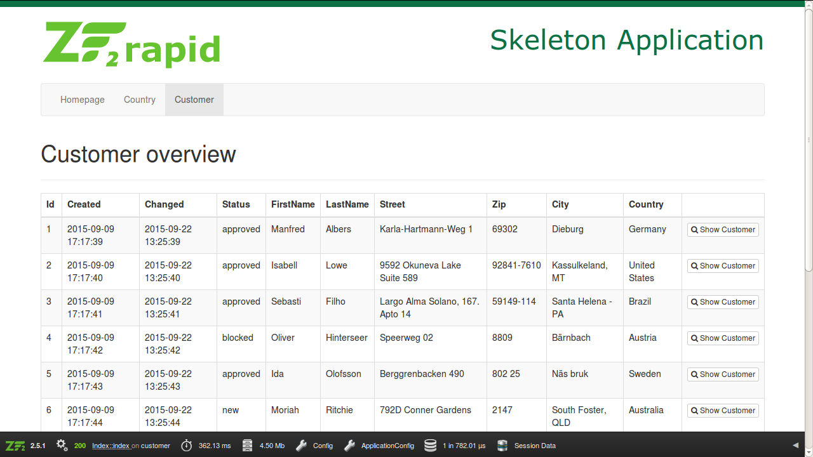
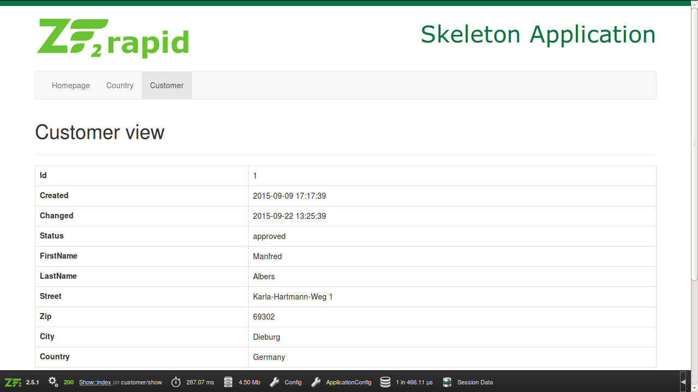

# ZF2rapid tutorial

In this tutorial you will learn how to create an application step by step with
ZF2rapid.

 * [Create new project](tutorial-create-project.md)
 * [Create new module](tutorial-create-module.md)
 * [Create controllers and actions](tutorial-create-controllers-actions.md)
 * [Create routing and generate maps](tutorial-create-routing-maps.md)
 * [Create controller plugin and view helper](tutorial-create-controller-plugin-view-helper.md)
 * [Create model classes](tutorial-crud-create-model.md)
 * **Create application**

## Create customer application

To create the application for an existing model entity, you need to create the model entity 
first. If you haven't done this, please refer to the [previous chapter](tutorial-crud-create-model.md).

In the previous chapter we created all model classes withing the module `CustomerDomain`. Now we
will split our application from our model to ease the reusability. So first we will create a new 
model for our customer application.

    $ zf2rapid create-module Customer

Now you are ready to create your customer application based on the `CustomerEntity` created before 
which should be found in the `CustomerDomain` module.
 
    $ zf2rapid crud-create-application Customer CustomerDomain/CustomerEntity

That was it. With this command the controllers, the views, a translation file and the configuration
for controllers, routing, translator and navigation have been created in one simple step.

The following tasks are executed when creating new application:

 * Load entity from model module
 * Create directory structure for application
 * Create index controller class
 * Create index controller factory
 * Create show controller class
 * Create show controller factory
 * Create application configuration
 * Create index view script
 * Create show view script
 * Create translation file

## Structure of module `Customer` after application creation

The generated structure of the `Customer` module should look like this:

    --- module
      +--- Application
      +--- Customer
         +--- config
         |  +--- module.config.php                             <---- updated file
         +--- language                                         <---- new directory
         |  +--- en_US.php                                     <---- new file
         +--- src
         |  +--- Customer
         |       +--- Application                              <---- new directory
         |           +--- Controller                           <---- new directory
         |           |  +--- IndexController.php               <---- new file
         |           |  +--- IndexControllerFactory.php        <---- new file
         |           |  +--- ShowController.php                <---- new file
         |           |  +--- ShowControllerFactory.php         <---- new file
         +--- view
         |  +--- customer
         |     +--- index                                      <---- new directory
         |     |  +--- index.phtml                             <---- new file
         |     +--- show                                       <---- new directory
         |        +--- index.phtml                             <---- new file
         +--- autoload_classmap.php
         +--- Module.php
         +--- template_map.php
      +--- CustomerDomain
      +--- Shop
         
The configuration in the `/module/Customer/config/module.config.php` file for the 
application should be look similar to this. 

    <?php
    /**
     * ZF2 Application built by ZF2rapid
     *
     * @copyright (c) 2015 John Doe
     * @license http://opensource.org/licenses/MIT The MIT License (MIT)
     */
    
    return array(
        [...]
        'controllers' => array(
            'factories' => array(
                'Customer\\Index' => 'Customer\\Application\\Controller\\IndexControllerFactory',
                'Customer\\Show' => 'Customer\\Application\\Controller\\ShowControllerFactory',
            ),
        ),
        'router' => array(
            'routes' => array(
                'customer' => array(
                    'type' => 'Literal',
                    'options' => array(
                        'route' => '/customer',
                        'defaults' => array(
                            '__NAMESPACE__' => 'Customer',
                            'controller' => 'Index',
                            'action' => 'index',
                        ),
                    ),
                    'may_terminate' => true,
                    'child_routes' => array(
                        'show' => array(
                            'type' => 'segment',
                            'options' => array(
                                'route' => '/show[/:id]',
                                'defaults' => array(
                                    'controller' => 'Show',
                                ),
                                'constraints' => array(
                                    'id' => '[a-z0-9-]*',
                                ),
                            ),
                        ),
                    ),
                ),
            ),
        ),
        'translator' => array(
            'translation_file_patterns' => array(
                array(
                    'type' => 'phpArray',
                    'base_dir' => CUSTOMER_MODULE_ROOT . '/language',
                    'pattern' => '%s.php',
                ),
            ),
        ),
        'navigation' => array(
            'default' => array(
                'customer' => array(
                    'type' => 'mvc',
                    'order' => '200',
                    'label' => 'customer_navigation_index',
                    'route' => 'customer',
                    '__NAMESPACE__' => 'Customer',
                    'controller' => 'Index',
                    'action' => 'index',
                    'pages' => array(
                        'show' => array(
                            'type' => 'mvc',
                            'route' => 'customer/show',
                            'visible' => false,
                        ),
                    ),
                ),
            ),
        ),
    );

## Generated translation file

In the `/module/Customer/language/en_US.php` file you will find a translation file for the 
`en_US` locale.

    <?php
    /**
     * ZF2 Application built by ZF2rapid
     *
     * @copyright (c) 2015 John Doe
     * @license http://opensource.org/licenses/MIT The MIT License (MIT)
     */
    
    return array(
        'customer_message_customer_not_found' => 'No Customer found.',
        'customer_title_index' => 'Customer overview',
        'customer_title_show' => 'Customer view',
        'customer_navigation_index' => 'Customer',
        'customer_navigation_show' => 'Customer view',
        'customer_action_index' => 'Customer overview',
        'customer_action_show' => 'Show Customer',
        'customer_label_id' => 'Id',
        'customer_label_created' => 'Created',
        'customer_label_changed' => 'Changed',
        'customer_label_status' => 'Status',
        'customer_label_first_name' => 'FirstName',
        'customer_label_last_name' => 'LastName',
        'customer_label_street' => 'Street',
        'customer_label_zip' => 'Zip',
        'customer_label_city' => 'City',
        'customer_label_country' => 'Country',
    );

You should edit the file to add proper texts since all texts were auto-generated. If you need other 
languages just copy the file and rename it to another locale like `de_DE` or `es_ES`, for example. 

## Generated controller classes

The `/module/Customer/src/Customer/Application/Controller/IndexController.php` file contains 
the `IndexController` class and is responsible to generate a list of customers. The 
`CustomerRepository` can be injected to the controller and is used to get all customers from 
the database.

    <?php
    /**
     * ZF2 Application built by ZF2rapid
     *
     * @copyright (c) 2015 John Doe
     * @license http://opensource.org/licenses/MIT The MIT License (MIT)
     */
    namespace Customer\Application\Controller;
    
    use CustomerDomain\Model\Repository\CustomerRepository;
    use Zend\Mvc\Controller\AbstractActionController;
    use Zend\View\Model\ViewModel;
    
    /**
     * IndexController
     *
     * Handles the IndexController requests for the Customer Module
     *
     * @package Customer\Application\Controller
     */
    class IndexController extends AbstractActionController
    {
        /**
         * @var CustomerRepository
         */
        private $customerRepository = null;
    
        /**
         * Set CustomerRepository
         *
         * @param CustomerRepository $customerRepository
         */
        public function setCustomerRepository(CustomerRepository $customerRepository)
        {
            $this->customerRepository = $customerRepository;
        }
    
        /**
         * Index action for IndexController
         *
         * @return ViewModel
         */
        public function indexAction()
        {
            $customerList = $this->customerRepository->getAllEntities();
    
            $viewModel = new ViewModel(
                array(
                    'customerList' => $customerList
                )
            );
    
            return $viewModel;
        }
    }

The corresponding factory can be found in the `/module/Customer/src/Customer/Application/Controller/IndexControllerFactory.php`
file and injects the needed `CustomerRepository` into the `IndexController` instance.  

    <?php
    /**
     * ZF2 Application built by ZF2rapid
     *
     * @copyright (c) 2015 John Doe
     * @license http://opensource.org/licenses/MIT The MIT License (MIT)
     */
    namespace Customer\Application\Controller;
    
    use CustomerDomain\Model\Repository\CustomerRepository;
    use Zend\ServiceManager\FactoryInterface;
    use Zend\ServiceManager\ServiceLocatorAwareInterface;
    use Zend\ServiceManager\ServiceLocatorInterface;
    
    /**
     * IndexControllerFactory
     *
     * Creates an instance of IndexController
     *
     * @package Customer\Application\Controller
     */
    class IndexControllerFactory implements FactoryInterface
    {
        /**
         * Create service
         *
         * @param ServiceLocatorInterface $controllerManager
         * @return IndexController
         */
        public function createService(ServiceLocatorInterface $controllerManager)
        {
            /** @var ServiceLocatorAwareInterface $controllerManager */
            $serviceLocator = $controllerManager->getServiceLocator();
    
            /** @var CustomerRepository $customerRepository */
            $customerRepository = $serviceLocator->get('CustomerDomain\Model\Repository\Customer');
    
            $instance = new IndexController();
            $instance->setCustomerRepository($customerRepository);
    
            return $instance;
        }
    }

Please also have a look at the `ShowController` class in the same directory. This controller 
is responsible for displaying a single customer. It checks the `id` param from the route and 
if a customer can be found for the specified `id`. If the checks fail a message is passed to
the `FlashMessenger` and a redirect is send to the customer overview. The following listing 
just shows the `indexAction()` method of the `ShowController`.

    <?php
    class ShowController extends AbstractActionController
    {
        [...]
    
        /**
         * Index action for ShowController
         *
         * @return ViewModel
         */
        public function indexAction()
        {
            $id = $this->params()->fromRoute('id');
    
            if (!$id) {
                $this->flashMessenger()->addErrorMessage('customer_message_customer_not_found');
                
                return $this->redirect()->toRoute('customer');
            }
    
            $customerEntity = $this->customerRepository->getEntityById($id);
    
            if (!$customerEntity) {
                $this->flashMessenger()->addErrorMessage('customer_message_customer_not_found');
                
                return $this->redirect()->toRoute('customer');
            }
    
            $viewModel = new ViewModel(
                array(
                    'customerEntity' => $customerEntity
                )
            );
    
            return $viewModel;
        }
    }

The `ShowControllerFactory` looks very similar to the `IndexControllerFactory` shown above.

## Generated views

The `/module/Customer/view/customer/index/index.phtml` file contains the output of the 
customer list in a HTML table. It adds a link to the `customer/show` route.

    <?php
    /**
     * ZF2 Application built by ZF2rapid
     *
     * @copyright (c) 2015 John Doe
     * @license http://opensource.org/licenses/MIT The MIT License (MIT)
     */
    use CustomerDomain\Model\Entity\CustomerEntity;
    
    $this->h1('customer_title_index');
    ?>
    <table class="table table-bordered table-striped">
        <thead>
        <tr>
            <th><?php echo $this->translate('customer_label_id'); ?></th>
            <th><?php echo $this->translate('customer_label_created'); ?></th>
            <th><?php echo $this->translate('customer_label_changed'); ?></th>
            <th><?php echo $this->translate('customer_label_status'); ?></th>
            <th><?php echo $this->translate('customer_label_first_name'); ?></th>
            <th><?php echo $this->translate('customer_label_last_name'); ?></th>
            <th><?php echo $this->translate('customer_label_street'); ?></th>
            <th><?php echo $this->translate('customer_label_zip'); ?></th>
            <th><?php echo $this->translate('customer_label_city'); ?></th>
            <th><?php echo $this->translate('customer_label_country'); ?></th>
            <th>&nbsp;</th>
        </tr>
        </thead>
        <tbody>
        <?php /** @var CustomerEntity $customerEntity */ ?>
        <?php foreach ($this->customerList as $customerEntity): ?>
            <tr>
                <td><?php echo $customerEntity->getId() ?></td>
                <td><?php echo $customerEntity->getCreated() ?></td>
                <td><?php echo $customerEntity->getChanged() ?></td>
                <td><?php echo $customerEntity->getStatus() ?></td>
                <td><?php echo $customerEntity->getFirstName() ?></td>
                <td><?php echo $customerEntity->getLastName() ?></td>
                <td><?php echo $customerEntity->getStreet() ?></td>
                <td><?php echo $customerEntity->getZip() ?></td>
                <td><?php echo $customerEntity->getCity() ?></td>
                <td><?php echo $customerEntity->getCountry() ?></td>
                <td>
                    <a class="btn btn-default btn-xs" href="<?php echo $this->url('customer/show', array('id' => $customerEntity->getIdentifier())); ?>">
                        <i class="fa fa-search"></i>
                        <?php echo $this->translate('customer_action_show'); ?>
                    </a>
                </td>
            </tr>
        <?php endforeach; ?>
        </tbody>
    </table>

**Please note:** You can easily extend all the generated classes and view scripts for this application 
but you must be aware that you currently cannot rerun the application generation without the loss of 
your amendments. If your entity class has changed a lot you could generate the application again in a new 
module and merge the additions with your application module.

## View application in your browser

Now you can open your application in your prefered browser by calling the URL 
[http://zf2rapid.tutorial/customer](http://zf2rapid.tutorial/customer). Your screen should 
look like this:

If you click on any `Show Customer` link your screen should look like this:

## Create country application

You probably noted the `Country` in the navigation bar at the top. This can easily be generated with the 
following command.  
 
    $ zf2rapid crud-create-application Country CustomerDomain/CountryEntity

Please have a close look at the `/module/Country` path to examine controller, views and the configuration 
of your country application. 
