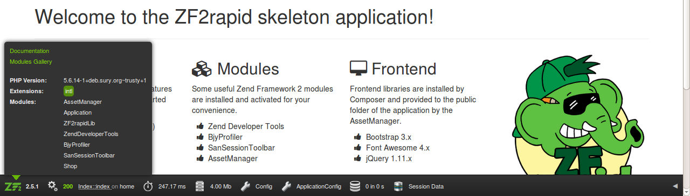

# ZF2rapid tutorial

In this tutorial you will learn how to create an application step by step with
ZF2rapid.

 * [Create new project](tutorial-create-project.md)
 * [Create new module](tutorial-create-module.md)
 * [Create controllers and actions](tutorial-create-controllers-actions.md)
 * [Create routing and generate maps](tutorial-create-routing-maps.md)
 * [Create controller plugin and view helper](tutorial-create-controller-plugin-view-helper.md)
 * [Create model classes](tutorial-crud-create-model.md)

## PLEASE READ CAREFULLY

The CRUD commands of ZF2rapid do not have the goal to create a full-featured
object-relational-mapper (ORM) for you. If you need such a tool please refer to 
[Doctrine](http://www.doctrine-project.org/), [Propel](http://propelorm.org/), 
[ReadBeanPHP](http://www.redbeanphp.com/) etc.

The classes generated by the CRUD commands try to consider the best practices of 
implementing a simple model layer with the Zend Framework 2. The entities represent 
your data as objects, the table gateways allow the access to database tables and 
the hydrators help to convert the data passed from the database to your 
entities. The generated repositories are meant to be used within your 
controllers or other classes which access to the data.

You can extend the generated classes and add more logic to it. But please 
note, that your amendments will be lost when you try to rebuild the classes 
after you made changes to your database structure. 

The generated classes should only be used for rapid prototyping or as a base for your
own implementations! 

## Create model classes

To create model classes for an existing database table, you need to setup a 
database first. Please create a MySQL database `zf2rapid-tutorial` first and 
grant the needed privileges to a user `zf2rapid` with the password `zf2rapid`.
To proceed this tutorial you can easily use the 
[MySQL database dump](tutorial-crud-database-structure.md)
to create a database structure. 

    SET FOREIGN_KEY_CHECKS=0;
    
    DROP TABLE IF EXISTS `country`;
    CREATE TABLE IF NOT EXISTS `country` (
      `code` char(2) NOT NULL,
      `name` varchar(64) NOT NULL,
      PRIMARY KEY (`code`)
    ) ENGINE=InnoDB DEFAULT CHARSET=utf8;
    
    INSERT INTO `country` (`code`, `name`) VALUES
    ('ad', 'Andorra'),
    ('ae', 'United Arab Emirates'),
    ('af', 'Afghanistan'),
    ('ag', 'Antigua and Barbuda'),
    ('ai', 'Anguilla'),
    ('al', 'Albania'),
    ('am', 'Armenia'),
    ('ao', 'Angola'),
    ('aq', 'Antarctica'),
    ('ar', 'Argentina'),
    ('as', 'American Samoa'),
    ('at', 'Austria'),
    ('au', 'Australia'),
    ('aw', 'Aruba'),
    ('ax', 'Åland Islands'),
    ('az', 'Azerbaijan'),
    ('ba', 'Bosnia and Herzegovina'),
    ('bb', 'Barbados'),
    ('bd', 'Bangladesh'),
    ('be', 'Belgium'),
    ('bf', 'Burkina Faso'),
    ('bg', 'Bulgaria'),
    ('bh', 'Bahrain'),
    ('bi', 'Burundi'),
    ('bj', 'Benin'),
    ('bl', 'Saint Barthélemy'),
    ('bm', 'Bermuda'),
    ('bn', 'Brunei Darussalam'),
    ('bo', 'Bolivia, Plurinational State of'),
    ('bq', 'Bonaire, Sint Eustatius and Saba'),
    ('br', 'Brazil'),
    ('bs', 'Bahamas'),
    ('bt', 'Bhutan'),
    ('bv', 'Bouvet Island'),
    ('bw', 'Botswana'),
    ('by', 'Belarus'),
    ('bz', 'Belize'),
    ('ca', 'Canada'),
    ('cc', 'Cocos (Keeling) Islands'),
    ('cd', 'Congo, the Democratic Republic of the'),
    ('cf', 'Central African Republic'),
    ('cg', 'Congo'),
    ('ch', 'Switzerland'),
    ('ci', 'Côte d''Ivoire'),
    ('ck', 'Cook Islands'),
    ('cl', 'Chile'),
    ('cm', 'Cameroon'),
    ('cn', 'China'),
    ('co', 'Colombia'),
    ('cr', 'Costa Rica'),
    ('cu', 'Cuba'),
    ('cv', 'Cape Verde'),
    ('cw', 'Curaçao'),
    ('cx', 'Christmas Island'),
    ('cy', 'Cyprus'),
    ('cz', 'Czech Republic'),
    ('de', 'Germany'),
    ('dj', 'Djibouti'),
    ('dk', 'Denmark'),
    ('dm', 'Dominica'),
    ('do', 'Dominican Republic'),
    ('dz', 'Algeria'),
    ('ec', 'Ecuador'),
    ('ee', 'Estonia'),
    ('eg', 'Egypt'),
    ('eh', 'Western Sahara'),
    ('er', 'Eritrea'),
    ('es', 'Spain'),
    ('et', 'Ethiopia'),
    ('fi', 'Finland'),
    ('fj', 'Fiji'),
    ('fk', 'Falkland Islands (Malvinas)'),
    ('fm', 'Micronesia, Federated States of'),
    ('fo', 'Faroe Islands'),
    ('fr', 'France'),
    ('ga', 'Gabon'),
    ('gb', 'United Kingdom'),
    ('gd', 'Grenada'),
    ('ge', 'Georgia'),
    ('gf', 'French Guiana'),
    ('gg', 'Guernsey'),
    ('gh', 'Ghana'),
    ('gi', 'Gibraltar'),
    ('gl', 'Greenland'),
    ('gm', 'Gambia'),
    ('gn', 'Guinea'),
    ('gp', 'Guadeloupe'),
    ('gq', 'Equatorial Guinea'),
    ('gr', 'Greece'),
    ('gs', 'South Georgia and the South Sandwich Islands'),
    ('gt', 'Guatemala'),
    ('gu', 'Guam'),
    ('gw', 'Guinea-Bissau'),
    ('gy', 'Guyana'),
    ('hk', 'Hong Kong'),
    ('hm', 'Heard Island and McDonald Islands'),
    ('hn', 'Honduras'),
    ('hr', 'Croatia'),
    ('ht', 'Haiti'),
    ('hu', 'Hungary'),
    ('id', 'Indonesia'),
    ('ie', 'Ireland'),
    ('il', 'Israel'),
    ('im', 'Isle of Man'),
    ('in', 'India'),
    ('io', 'British Indian Ocean Territory'),
    ('iq', 'Iraq'),
    ('ir', 'Iran, Islamic Republic of'),
    ('is', 'Iceland'),
    ('it', 'Italy'),
    ('je', 'Jersey'),
    ('jm', 'Jamaica'),
    ('jo', 'Jordan'),
    ('jp', 'Japan'),
    ('ke', 'Kenya'),
    ('kg', 'Kyrgyzstan'),
    ('kh', 'Cambodia'),
    ('ki', 'Kiribati'),
    ('km', 'Comoros'),
    ('kn', 'Saint Kitts and Nevis'),
    ('kp', 'Korea, Democratic People''s Republic of'),
    ('kr', 'Korea, Republic of'),
    ('kw', 'Kuwait'),
    ('ky', 'Cayman Islands'),
    ('kz', 'Kazakhstan'),
    ('la', 'Lao People''s Democratic Republic'),
    ('lb', 'Lebanon'),
    ('lc', 'Saint Lucia'),
    ('li', 'Liechtenstein'),
    ('lk', 'Sri Lanka'),
    ('lr', 'Liberia'),
    ('ls', 'Lesotho'),
    ('lt', 'Lithuania'),
    ('lu', 'Luxembourg'),
    ('lv', 'Latvia'),
    ('ly', 'Libya'),
    ('ma', 'Morocco'),
    ('mc', 'Monaco'),
    ('md', 'Moldova, Republic of'),
    ('me', 'Montenegro'),
    ('mf', 'Saint Martin (French part)'),
    ('mg', 'Madagascar'),
    ('mh', 'Marshall Islands'),
    ('mk', 'Macedonia, the Former Yugoslav Republic of'),
    ('ml', 'Mali'),
    ('mm', 'Myanmar'),
    ('mn', 'Mongolia'),
    ('mo', 'Macao'),
    ('mp', 'Northern Mariana Islands'),
    ('mq', 'Martinique'),
    ('mr', 'Mauritania'),
    ('ms', 'Montserrat'),
    ('mt', 'Malta'),
    ('mu', 'Mauritius'),
    ('mv', 'Maldives'),
    ('mw', 'Malawi'),
    ('mx', 'Mexico'),
    ('my', 'Malaysia'),
    ('mz', 'Mozambique'),
    ('na', 'Namibia'),
    ('nc', 'New Caledonia'),
    ('ne', 'Niger'),
    ('nf', 'Norfolk Island'),
    ('ng', 'Nigeria'),
    ('ni', 'Nicaragua'),
    ('nl', 'Netherlands'),
    ('no', 'Norway'),
    ('np', 'Nepal'),
    ('nr', 'Nauru'),
    ('nu', 'Niue'),
    ('nz', 'New Zealand'),
    ('om', 'Oman'),
    ('pa', 'Panama'),
    ('pe', 'Peru'),
    ('pf', 'French Polynesia'),
    ('pg', 'Papua New Guinea'),
    ('ph', 'Philippines'),
    ('pk', 'Pakistan'),
    ('pl', 'Poland'),
    ('pm', 'Saint Pierre and Miquelon'),
    ('pn', 'Pitcairn'),
    ('pr', 'Puerto Rico'),
    ('ps', 'Palestine, State of'),
    ('pt', 'Portugal'),
    ('pw', 'Palau'),
    ('py', 'Paraguay'),
    ('qa', 'Qatar'),
    ('re', 'Réunion'),
    ('ro', 'Romania'),
    ('rs', 'Serbia'),
    ('ru', 'Russian Federation'),
    ('rw', 'Rwanda'),
    ('sa', 'Saudi Arabia'),
    ('sb', 'Solomon Islands'),
    ('sc', 'Seychelles'),
    ('sd', 'Sudan'),
    ('se', 'Sweden'),
    ('sg', 'Singapore'),
    ('sh', 'Saint Helena, Ascension and Tristan da Cunha'),
    ('si', 'Slovenia'),
    ('sj', 'Svalbard and Jan Mayen'),
    ('sk', 'Slovakia'),
    ('sl', 'Sierra Leone'),
    ('sm', 'San Marino'),
    ('sn', 'Senegal'),
    ('so', 'Somalia'),
    ('sr', 'Suriname'),
    ('ss', 'South Sudan'),
    ('st', 'Sao Tome and Principe'),
    ('sv', 'El Salvador'),
    ('sx', 'Sint Maarten (Dutch part)'),
    ('sy', 'Syrian Arab Republic'),
    ('sz', 'Swaziland'),
    ('tc', 'Turks and Caicos Islands'),
    ('td', 'Chad'),
    ('tf', 'French Southern Territories'),
    ('tg', 'Togo'),
    ('th', 'Thailand'),
    ('tj', 'Tajikistan'),
    ('tk', 'Tokelau'),
    ('tl', 'Timor-Leste'),
    ('tm', 'Turkmenistan'),
    ('tn', 'Tunisia'),
    ('to', 'Tonga'),
    ('tr', 'Turkey'),
    ('tt', 'Trinidad and Tobago'),
    ('tv', 'Tuvalu'),
    ('tw', 'Taiwan, Province of China'),
    ('tz', 'Tanzania, United Republic of'),
    ('ua', 'Ukraine'),
    ('ug', 'Uganda'),
    ('um', 'United States Minor Outlying Islands'),
    ('us', 'United States'),
    ('uy', 'Uruguay'),
    ('uz', 'Uzbekistan'),
    ('va', 'Holy See (Vatican City State)'),
    ('vc', 'Saint Vincent and the Grenadines'),
    ('ve', 'Venezuela, Bolivarian Republic of'),
    ('vg', 'Virgin Islands, British'),
    ('vi', 'Virgin Islands, U.S.'),
    ('vn', 'Viet Nam'),
    ('vu', 'Vanuatu'),
    ('wf', 'Wallis and Futuna'),
    ('ws', 'Samoa'),
    ('ye', 'Yemen'),
    ('yt', 'Mayotte'),
    ('za', 'South Africa'),
    ('zm', 'Zambia'),
    ('zw', 'Zimbabwe');
    
    DROP TABLE IF EXISTS `customer`;
    CREATE TABLE IF NOT EXISTS `customer` (
      `id` mediumint(8) unsigned NOT NULL AUTO_INCREMENT,
      `created` datetime DEFAULT NULL,
      `changed` datetime DEFAULT NULL,
      `status` enum('new','approved','blocked') NOT NULL DEFAULT 'new',
      `first_name` varchar(64) NOT NULL,
      `last_name` varchar(64) NOT NULL,
      `street` varchar(64) NOT NULL,
      `zip` varchar(12) NOT NULL,
      `city` varchar(64) NOT NULL,
      `country` char(2) DEFAULT NULL,
      PRIMARY KEY (`id`),
      KEY `country` (`country`)
    ) ENGINE=InnoDB  DEFAULT CHARSET=utf8 AUTO_INCREMENT=3 ;
    
    INSERT INTO `customer` (`id`, `created`, `changed`, `status`, `first_name`, `last_name`, `street`, `zip`, `city`, `country`) VALUES
    (1, '2015-09-09 17:17:39', '2015-09-22 13:25:39', 'new', 'Manfred', 'Mustermann', 'Musterstrasse 123', '12345', 'Musterhausen', 'de'),
    (2, '2015-09-15 05:30:19', '2015-09-22 18:08:11', 'approved', 'John', 'Doe', 'Sunrise Avenue', '98765', 'Somewhere', 'us');
    
    ALTER TABLE `customer`
      ADD CONSTRAINT `customer_ibfk_1` FOREIGN KEY (`country`) REFERENCES `country` (`code`) ON DELETE SET NULL ON UPDATE NO ACTION;
    
    SET FOREIGN_KEY_CHECKS=1;

Afterwards you need to setup the database connection in your current project. 
This should be done in the file `/config/autoload/development.php`, for example. 
Please enter your database configuration.

    return array(
        'db' => array(
            'driver'  => 'pdo',
            'dsn'     => 'mysql:dbname=zf2rapid-tutorial;host=localhost;charset=utf8',
            'user'    => 'zf2rapid',
            'pass'    => 'zf2rapid',
        ),
        [...]
    );

To use the CRUD commands you need to setup the database connection in the 
project you want to create the classes and views in. This should be done in the 
file `/config/autoload/development.php`, for example. Please enter your own 
database configuration.

    return array(
        'db' => array(
            'driver'  => 'pdo',
            'dsn'     => 'mysql:dbname=DATEBASE;host=localhost;charset=utf8',
            'user'    => 'USER',
            'pass'    => 'PASS',
        ),
        [...]
    );

Now you can check if your database configuration is correct and if you can 
access your database.
 
    $ zf2rapid crud-check-db

If you get the message `The connection to the database was successful.` you 
show a list of all tables which are accessible for this database 
configuration. 

    $ zf2rapid crud-show-tables

Ww want to create a new `Customer` module first. All classes and files from the 
CRUD commands should be placed within this module. 
  
    $ zf2rapid create-module Customer

Now you are ready to create all model classes for the tables within the new 
`Customer` module . We will start with the `customer` table.
 
    $ zf2rapid crud-create-model Customer customer

Oops. You should get the error message `Due to a foreign key constraint you 
need to process table country from database zf2rapid-example as well.`. The 
table `customer` is connected to the table `country` with a foreign key 
constraint. To fully create the model classes for the `customer` table you also 
need to specify the `country` table as well.

    $ zf2rapid crud-create-model Customer customer,country

The following tasks are executed when creating new model classes:

 * Load tables from database
 * Create directory structure for model classes
 * Create entity class(es)
 * (optional) Create hydrator strategy class(es)
 * Create hydrator class(es)
 * Create hydrator factory(ies)
 * Create table gateway class(es)
 * Create table gateway factory(ies)
 * Create repository class(es)
 * Create repository factory(ies)
 * Writing model configuration for module

## Structure of new module

The generated structure of the `Customer` module should look like this:

    --- module
      +--- Application
      +--- Customer
         +--- config
         |  +--- module.config.php
         +--- src
         |  +--- Customer
         |       +--- Model                                    <---- new directory
         |           +--- Entity                               <---- new directory
         |           |  +--- CountryEntity.php                 <---- new file
         |           |  +--- CustomerEntity.php                <---- new file
         |           +--- Hydrator                             <---- new directory
         |           |  +--- Strategy                          <---- new directory
         |           |     +--- CountryStrategy.php            <---- new file
         |           |  +--- CountryHydrator.php               <---- new file
         |           |  +--- CountryHydratorFactory.php        <---- new file
         |           |  +--- CustomerHydrator.php              <---- new file
         |           |  +--- CustomerHydratorFactory.php       <---- new file
         |           +--- Repository                           <---- new directory
         |           |  +--- CountryRepository.php             <---- new file
         |           |  +--- CountryRepositoryFactory.php      <---- new file
         |           |  +--- CustomerRepository.php            <---- new file
         |           |  +--- CustomerRepositoryFactory.php     <---- new file
         |           +--- TableGateway                         <---- new directory
         |              +--- CountryTableGateway.php           <---- new file
         |              +--- CountryTableGatewayFactory.php    <---- new file
         |              +--- CustomerTableGateway.php          <---- new file
         |              +--- CustomerTableGatewayFactory.php   <---- new file
         +--- view
         |  +--- customer
         +--- autoload_classmap.php
         +--- Module.php
         +--- template_map.php
      +--- Shop
         
To the `/module/Customer/config/module.config.php` file the configuration for the 
model classes should be added. 

    <?php
    /**
     * ZF2rapid Tutorial
     *
     * @copyright (c) 2015 John Doe
     * @license All rights reserved
     */
    
    return array(
        [...]
        'hydrators' => array(
            'factories' => array(
                'Customer\\Db\\Customer' => 'Customer\\Model\\Hydrator\\CustomerHydratorFactory',
                'Customer\\Db\\Country' => 'Customer\\Model\\Hydrator\\CountryHydratorFactory',
            ),
        ),
        'service_manager' => array(
            'factories' => array(
                'Customer\\Model\\TableGateway\\Customer' => 'Customer\\Model\\TableGateway\\CustomerTableGatewayFactory',
                'Customer\\Model\\Repository\\Customer' => 'Customer\\Model\\Repository\\CustomerRepositoryFactory',
                'Customer\\Model\\TableGateway\\Country' => 'Customer\\Model\\TableGateway\\CountryTableGatewayFactory',
                'Customer\\Model\\Repository\\Country' => 'Customer\\Model\\Repository\\CountryRepositoryFactory',
            ),
        ),
    );

## Generated entity classes

The `/module/Customer/src/Customer/Model/Entity/CountryEntity.php` file contains 
the `CountryEntity` class, which consists of the properties `code` and `name` 
from the database table `country` and the corresponding setter and getter 
methods.

    <?php
    /**
     * ZF2 Application built by ZF2rapid
     *
     * @copyright (c) 2015 John Doe
     * @license http://opensource.org/licenses/MIT The MIT License (MIT)
     */
    
    namespace Customer\Model\Entity;
    
    use ZF2rapidDomain\Entity\AbstractEntity;
    
    /**
     * CountryEntity
     *
     * Provides the CountryEntity entity for the Customer Module
     *
     * @package Customer\Model\Entity
     */
    class CountryEntity extends AbstractEntity
    {
    
        /**
         * code property
         *
         * @var string
         */
        protected $code = null;
    
        /**
         * name property
         *
         * @var string
         */
        protected $name = null;
    
        /**
         * Get the primary identifier
         *
         * @return string
         */
        public function getIdentifier()
        {
            return $this->getCode();
        }
    
        /**
         * Set code
         *
         * @param string $code
         */
        protected function setCode($code)
        {
            $this->code = (string) $code;
        }
    
        /**
         * Get code
         *
         * @return string
         */
        public function getCode()
        {
            return $this->code;
        }
    
        /**
         * Set name
         *
         * @param string $name
         */
        protected function setName($name)
        {
            $this->name = (string) $name;
        }
    
        /**
         * Get name
         *
         * @return string
         */
        public function getName()
        {
            return $this->name;
        }
    }

The `/module/Customer/src/Customer/Model/Entity/CustomerEntity.php` file 
contains the `CustomerEntity` class, which consists all the properties from the 
database table `customer` and the corresponding setter and getter methods.

    <?php
    /**
     * ZF2 Application built by ZF2rapid
     *
     * @copyright (c) 2015 John Doe
     * @license http://opensource.org/licenses/MIT The MIT License (MIT)
     */
    
    namespace Customer\Model\Entity;
    
    use ZF2rapidDomain\Entity\AbstractEntity;
    
    /**
     * CustomerEntity
     *
     * Provides the CustomerEntity entity for the Customer Module
     *
     * @package Customer\Model\Entity
     */
    class CustomerEntity extends AbstractEntity
    {
    
        /**
         * id property
         *
         * @var integer
         */
        protected $id = null;
    
        /**
         * created property
         *
         * @var string
         */
        protected $created = null;
    
        /**
         * changed property
         *
         * @var string
         */
        protected $changed = null;
    
        /**
         * status property
         *
         * @var string
         */
        protected $status = null;
    
        /**
         * firstName property
         *
         * @var string
         */
        protected $firstName = null;
    
        /**
         * lastName property
         *
         * @var string
         */
        protected $lastName = null;
    
        /**
         * street property
         *
         * @var string
         */
        protected $street = null;
    
        /**
         * zip property
         *
         * @var string
         */
        protected $zip = null;
    
        /**
         * city property
         *
         * @var string
         */
        protected $city = null;
    
        /**
         * country property
         *
         * @var CountryEntity
         */
        protected $country = null;
    
        /**
         * Get the primary identifier
         *
         * @return integer
         */
        public function getIdentifier()
        {
            return $this->getId();
        }
    
        /**
         * Set id
         *
         * @param integer $id
         */
        protected function setId($id)
        {
            $this->id = (integer) $id;
        }
    
        /**
         * Get id
         *
         * @return integer
         */
        public function getId()
        {
            return $this->id;
        }
    
        /**
         * Set created
         *
         * @param string $created
         */
        protected function setCreated($created)
        {
            $this->created = (string) $created;
        }
    
        /**
         * Get created
         *
         * @return string
         */
        public function getCreated()
        {
            return $this->created;
        }
    
        /**
         * Set changed
         *
         * @param string $changed
         */
        protected function setChanged($changed)
        {
            $this->changed = (string) $changed;
        }
    
        /**
         * Get changed
         *
         * @return string
         */
        public function getChanged()
        {
            return $this->changed;
        }
    
        /**
         * Set status
         *
         * @param string $status
         */
        protected function setStatus($status)
        {
            $this->status = (string) $status;
        }
    
        /**
         * Get status
         *
         * @return string
         */
        public function getStatus()
        {
            return $this->status;
        }
    
        /**
         * Set firstName
         *
         * @param string $firstName
         */
        protected function setFirstName($firstName)
        {
            $this->firstName = (string) $firstName;
        }
    
        /**
         * Get firstName
         *
         * @return string
         */
        public function getFirstName()
        {
            return $this->firstName;
        }
    
        /**
         * Set lastName
         *
         * @param string $lastName
         */
        protected function setLastName($lastName)
        {
            $this->lastName = (string) $lastName;
        }
    
        /**
         * Get lastName
         *
         * @return string
         */
        public function getLastName()
        {
            return $this->lastName;
        }
    
        /**
         * Set street
         *
         * @param string $street
         */
        protected function setStreet($street)
        {
            $this->street = (string) $street;
        }
    
        /**
         * Get street
         *
         * @return string
         */
        public function getStreet()
        {
            return $this->street;
        }
    
        /**
         * Set zip
         *
         * @param string $zip
         */
        protected function setZip($zip)
        {
            $this->zip = (string) $zip;
        }
    
        /**
         * Get zip
         *
         * @return string
         */
        public function getZip()
        {
            return $this->zip;
        }
    
        /**
         * Set city
         *
         * @param string $city
         */
        protected function setCity($city)
        {
            $this->city = (string) $city;
        }
    
        /**
         * Get city
         *
         * @return string
         */
        public function getCity()
        {
            return $this->city;
        }
    
        /**
         * Set country
         *
         * @param CountryEntity $country
         */
        protected function setCountry(CountryEntity $country)
        {
            $this->country = $country;
        }
    
        /**
         * Get country
         *
         * @return CountryEntity
         */
        public function getCountry()
        {
            return $this->country;
        }
    }

## Generated hydrator classes, strategies and factories

## Generated table gateway classes and factories

## Generated repository classes and factories

  
